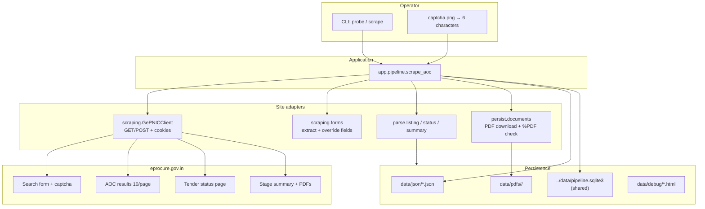
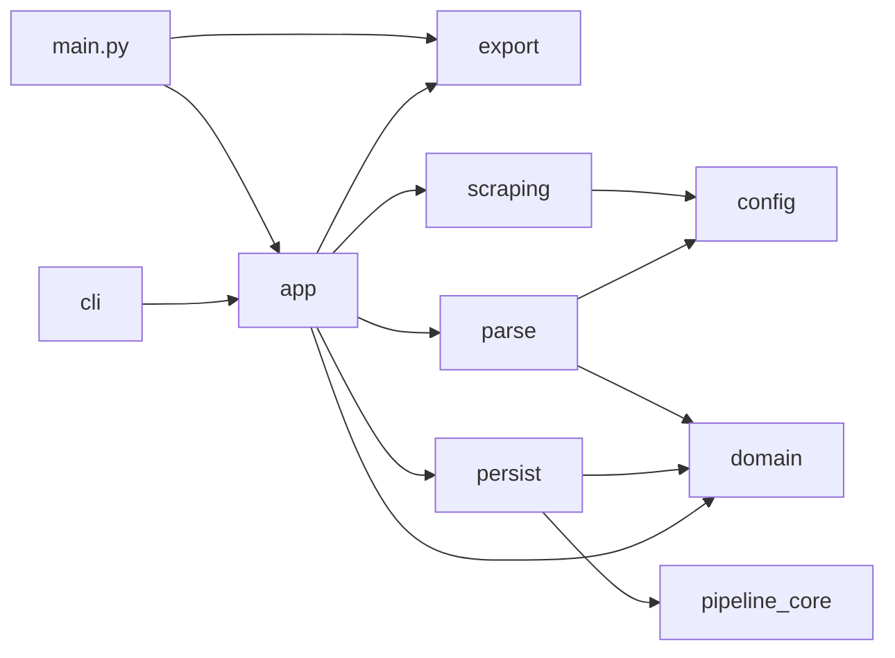

# Architecture

stage1-scrape collects **Award of Contract (AOC)** records from the public Central Public Procurement Portal. There is no official API. The scraper repeats a browser visit: search form → captcha → AOC listing → tender status → stage summary → PDFs.



## Layers

Dependencies point inward. The CLI does not parse HTML. Parsers do not write SQLite. HTTP does not know what a `TenderRecord` is beyond passing bytes.

| Layer | Package | Responsibility |
| --- | --- | --- |
| Runner | `main.py` (project root) | one command, start to finish; constants not argparse |
| CLI | `stage1_scrape.cli` | argparse only |
| Application | `stage1_scrape.app` | order of steps 0–5 |
| Config | `stage1_scrape.config` | URLs, AOC code `6`, headers |
| Domain | `stage1_scrape.domain` | `TenderRecord`, errors |
| Scraping | `stage1_scrape.scraping` | session, forms, captcha image |
| Parse | `stage1_scrape.parse` | listing, status, summary HTML |
| Persist | `stage1_scrape.persist` | JSON, PDF files, the shared database |
| Export | `stage1_scrape.export` | read-only: vendor rows → CSV/Excel |
| Schema | `pipeline_core` (`../core`) | the tables themselves, shared by all three stages |



## Package map

```text
main.py                  entry: one command, scrape then vendors.csv
src/stage1_scrape/
  cli.py                 entry: probe / scrape / run / index
  config.py              portal constants
  domain/
    models.py            ListingRow, BidRow, TenderRecord
    errors.py            CaptchaError, ParseError, ...
  scraping/
    client.py            cookies, delay, GET/POST
    forms.py             Tapestry field bags (keep duplicate names)
    captcha.py           #captchaImage → captcha.png
  parse/
    listing.py           results table + Next
    status.py            stage-summary link
    summary.py           bids / AOC / document links
  persist/
    store.py             JSON + the shared database (pipeline_core)
    documents.py         download + %PDF check
  app/
    pipeline.py          scrape_aoc, probe_search_form
    run.py               run_scrape (scrape, then rewrite the sheet)
  export/
    vendor_sheet.py      VENDOR_SHEET_COLUMNS, write_vendor_sheet(store, out)
```

Every column in the sheet comes from the portal or a downloaded PDF. There are no
model-generated columns: a contact found by stage 2 lives in the shared database,
not in this file.

## Runtime data

All of this is gitignored. It is not source.

```text
data/
  captcha.png
  session.pkl            cookies from the last probe/search
  json/<tender_id>.json
  pdfs/<tender_id>/*.pdf
  debug/                 search form, listing, status, summary HTML
  exports/
    vendors.csv          15 cols, scrape + PDF facts only
    vendors.xlsx
```

The tables themselves are **not** here — they live in `../../data/pipeline.sqlite3`,
shared with stages 2 and 3.
